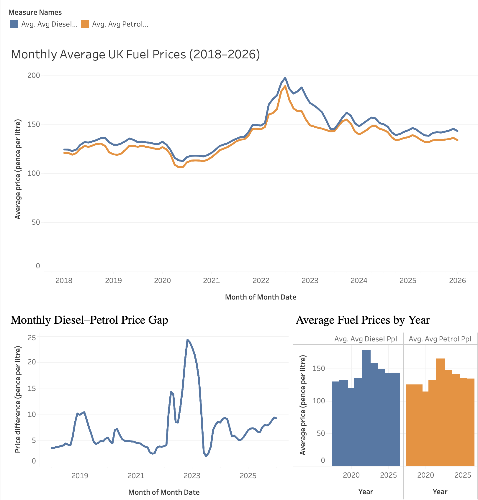

# UK Weekly Road Fuel Prices (2018–2026) — SQL Analysis

## Project Overview

This project analyses UK weekly road fuel prices using official government data, aggregated to monthly averages for clearer trend analysis.

## Dataset
Source: UK Government – Weekly road fuel prices (CSV), 2018–2026.  
(Download link: https://www.gov.uk/government/statistics/weekly-road-fuel-prices)

---

**Tools used:**
- SQL (MySQL) – data cleaning and aggregation
- Tableau Public – data visualisation and dashboarding
- Excel – initial data validation

## Key questions
- How have petrol and diesel prices changed over time?
- Which fuel type is more expensive on average?
- What are the peak and lowest prices and when did they occur?
- What is the diesel–petrol price gap over time?
- What do monthly averages look like?

## 📊 Tableau Dashboard

**UK Fuel Prices Dashboard (2018–2026)**  
🔗 [View interactive dashboard on Tableau Public](https://public.tableau.com/app/profile/fatima.barkat/viz/UKFuelPricesDashboard20182026/UKFuelPricesDashboard20182026?publish=yes)

---

## 🔍 Key Insights

- Fuel prices reached their highest levels in 2022.
- Diesel was consistently more expensive than petrol.
- The difference between diesel and petrol prices increased during 2021–2022 and decreased after 2023.

